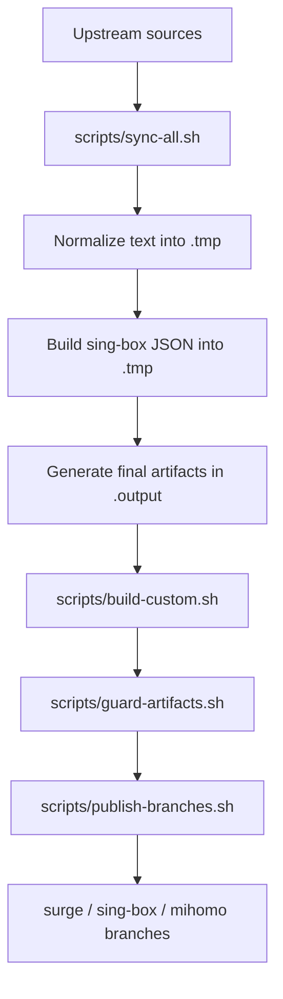
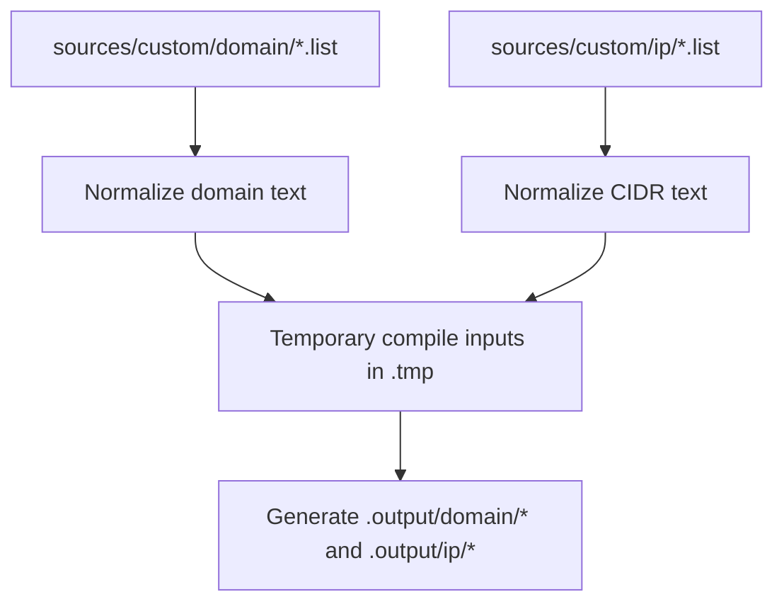

# Intermediate Artifacts

This document explains the conversion formats used during rule generation.

## Principles

- `.tmp/` is scratch space only
- temporary `.list`, `.txt`, and `.json` files are conversion inputs, not long-term artifacts
- published artifacts come only from `.output/`
- client branches contain only final files, not intermediate files

## Flowcharts

### Full Sync

### Custom Rules

### Artifact Layers

## What Is Temporary

These files are generated only to support compilation and do not need to be retained:

| Location | Typical format | Purpose |
| --- | --- | --- |
| `.tmp/sync/domain-build/` | `.list`, `.json` | normalized domain text and sing-box compile input |
| `.tmp/sync/ip-build/` | `.txt`, `.json` | normalized CIDR text and sing-box compile input |
| `.tmp/custom/domain/` | `.tmp`, `.list`, `.json` | custom domain normalization and compile input |
| `.tmp/custom/ip/` | `.tmp`, `.txt`, `.json` | custom IP normalization and compile input |

Notes:

- temporary `.list` and `.txt` files are normalized plain-text inputs
- temporary `.json` files are only for `sing-box rule-set compile`
- `*.srs.tmp` and `*.mrs.tmp` are short-lived write buffers before `write_if_changed`

## What Is Final

These are the only generated files intended to be preserved and published:

| Type | Surge | sing-box | mihomo |
| --- | --- | --- | --- |
| Domain | `.output/domain/surge/<name>.list` | `.output/domain/sing-box/<name>.srs` | `.output/domain/mihomo/<name>.mrs` |
| IP | `.output/ip/surge/<name>.list` | `.output/ip/sing-box/<name>.srs` | `.output/ip/mihomo/<name>.mrs` |

## Format Summary

### Domain Conversion

| Stage | Example |
| --- | --- |
| custom source | `DOMAIN,api.example.com` |
| custom source | `DOMAIN-SUFFIX,example.com` |
| normalized text | `api.example.com` |
| normalized text | `.example.com` |
| sing-box compile JSON | `{"version":3,"rules":[{"domain":["api.example.com"],"domain_suffix":["example.com"]}]}` |

### IP Conversion

| Stage | Example |
| --- | --- |
| custom source | `IP-CIDR,1.2.3.0/24` |
| custom source | `IP-CIDR6,2403:300::/32` |
| normalized text | `1.2.3.0/24` |
| normalized text | `2403:300::/32` |
| Surge output | `IP-CIDR,1.2.3.0/24,no-resolve` |
| Surge output | `IP-CIDR6,2403:300::/32,no-resolve` |
| sing-box compile JSON | `{"version":3,"rules":[{"ip_cidr":["1.2.3.0/24","2403:300::/32"]}]}` |

## Lifecycle

1. editable sources live in `sources/`
2. conversion helpers write normalized inputs to `.tmp/`
3. final client artifacts are written to `.output/`
4. publish scripts copy only final artifacts to client branches
